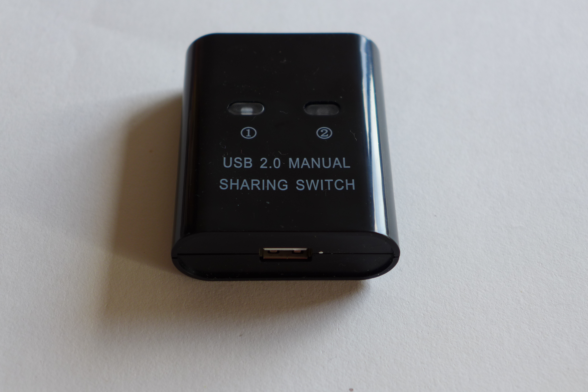

# USB switches to share devices

Requirement: Programmatically switch one device between 4 different computers.
This is required for automated testing of devices via there USB interface.

Professional switches are big, expensive and difficult to evaluate.

So I collected some usb switches which are sold in high volumes.

This evaluation may be helpful for others, so I am publishing it here.

## Copyright

Everything what I collect on this page is copyrighted by the manufactures. However, feel free to reuse my work of collecting the information, software etc.

## Switches

[aten-us421a](aten-us421a/)

Software controllable. Very bady usability.

[it-well_IT-102AU_USB2](it-well_IT-102AU_USB2/)

Software controllable via USB - somehow.

[it-well_IT-202MU_USB2](it-well_IT-202MU_USB2/)

[it-well_IT-204MU_USB2](it-well_IT-204MU_USB2/)

No USB hub, just analog switch. I added a Rpi Pico to control it using USB.

[it-well_IT-324AU_USB3](it-well_IT-324AU_USB3/)

[it-well_IT-424MU_USB2](it-well_IT-424MU_USB2/)

[ugreen_691_USB2](ugreen_691_USB2/)

