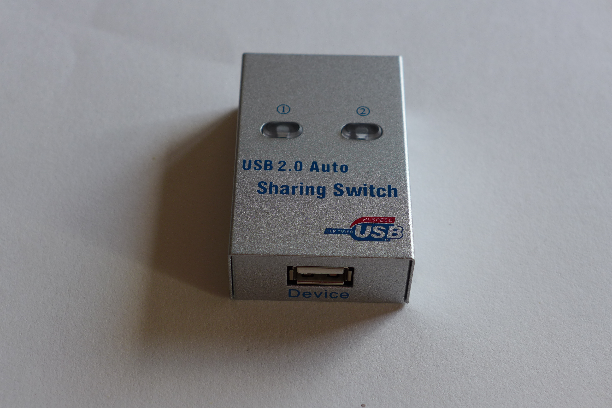
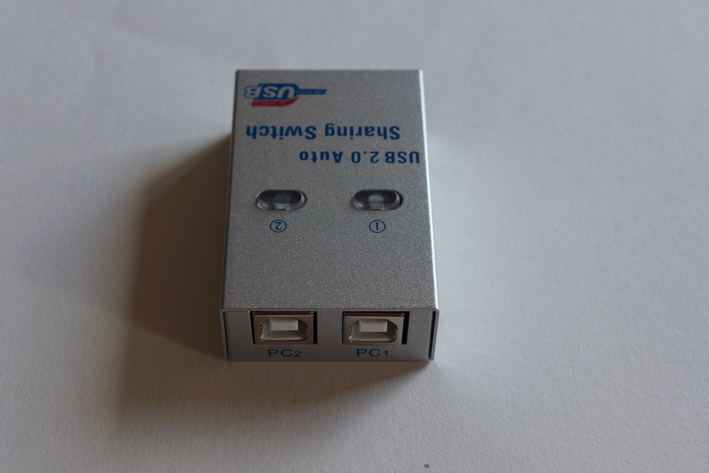
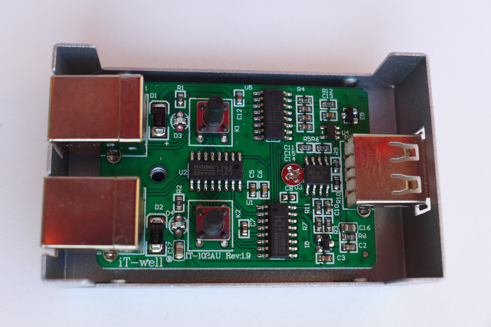

# iT-well IT-102MU rev. 1.9

* Aliexpress: https://www.aliexpress.com/item/33016664056.html
* USD 15

This is the software on the CDROM [it-well_IT-102AU_USB2.zip](it-well_IT-102AU_USB2.zip)

This software also works with the MT-SW241-CH!

## Links

Here is a libusb library to control this switch: https://blog.danman.eu/usb-switch-for-2-pc-under-linux/

--- images start ---

--- images end ---