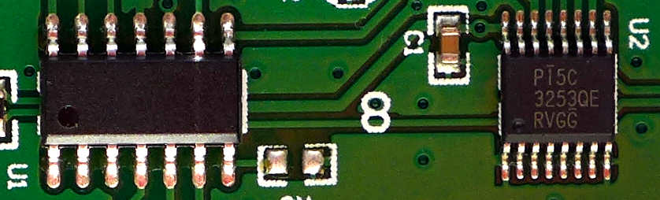
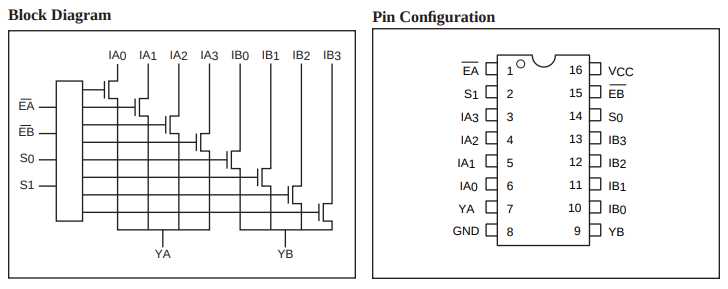

# iT-well IT-204 controlled via Raspberry Pi Pico

## Reengineering

* `U1` is a unknown 5V microprocessor.

* `U2` is a Pericom PI5C325 Dual 4:1 Mux/DeMux Bus Switch

https://www.diodes.com/assets/Datasheets/PI5C3253.pdf

`S0`/`S1` is used to switch one of the four USB ports.

## Raspberry Pi Pico

I measured these voltages:
* Button: 5V released, 0V pressed
* LED: 5V on

I replaced `U1` with a Rpi Pico:

| Function | IT-204MU | Rpi Pico |
| -- | -- | -- |
| Button 1 | 10 | 4 / GP2 |
| Button 2 | 1 | 5 / GP3 |
| Button 3 | 14 | 6 / GP4 |
| Button 4 | 13 | 7 / GP5 |
| LED 1 | 2 | 9 / GP6 |
| LED 2 | 12 | 10 / GP7 |
| LED 3 | 5 | 11 / GP8 |
| LED 4 | 6 | 12 / GP9 |
| S1 | 3 | 2 / GP1 |
| S0 | 8 | 1 / GP0 |
| GND | 11 | 3 / GND |

## Software

[main.py](main.py)

* The USB ports may be controlled by pressing the buttons.
* The LED indicates the active USB port.

| stimuli | `cat /dev/ttyACM0` |
| -- | -- |
| Button 1 pressed | `button(1)` | 
| `echo button(2) > /dev/ttyACM0` | `button(2)` | 
| `echo get() > /dev/ttyACM0` | `button(2)` | 
